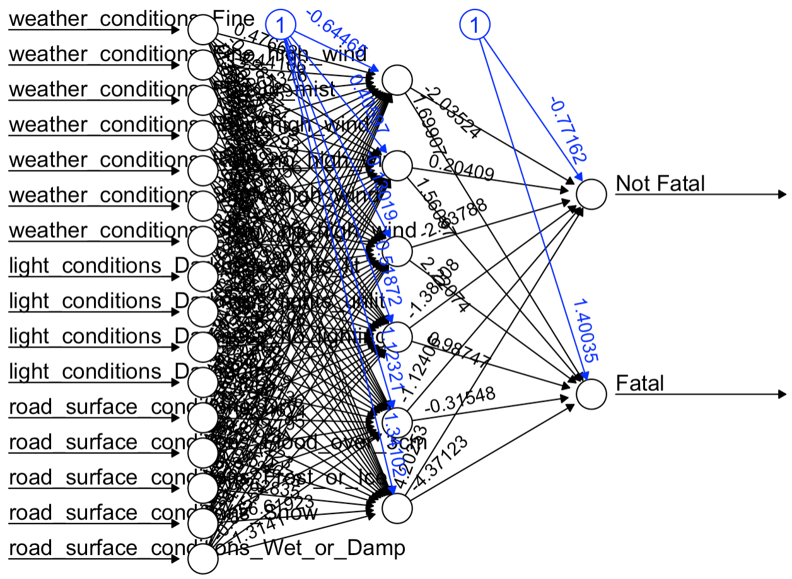

```{r setup, include=FALSE}
knitr::opts_chunk$set(echo = TRUE)
library(tidyverse)
library(janitor)
library(tree)
library(stats)
library(factoextra)
library(neuralnet)
library(mltools)
library(data.table)
library(MASS)
library(ISLR)
library(class)
<<<<<<< HEAD
library(ggplot2)
=======
library(caret)
>>>>>>> 6e79fd999127b29a59eab20b436754594cefc912
```

```{r, include=FALSE}
cas <- read_csv("cas.csv") %>%
  janitor::clean_names()
accidents <- read_csv("dftRoadSafety_Accidents_2016.csv") %>%
  janitor::clean_names()
makemodel <- read_csv("MakeModel2016.csv") %>%
  janitor::clean_names()
veh <- read_csv("veh.csv") %>%
  janitor::clean_names()
```

# Introduction\
Here we need a summary of what we are trying to discover in our report

## The Dataset\
This should provide an analysis of the dataset and explore trends/patters in the data

**EDA**
```{r}
table(accidents$accident_severity)

accidents$accident_severity %>% table() %>% data.table() %>% dplyr::rename(Severity='.',Count=N) %>% mutate(Severity=case_when(Severity == 1 ~ "Fatal", Severity == 2 ~ "Serious", Severity == 3 ~ "Slight")) %>% ggplot(aes(x=Severity, y=Count)) + geom_bar(stat="identity")
```

## Questions of Interest\
After exploring the data, we decided to analyze two questions of interest.

1. Can We Help Find Safer Routes For Cyclists?
2. Can we predict when an accident will be fatal based on the driving conditions?


# Methodology\
This section is for describing the methodology we will use to analyze our questions of interest


## Data cleaning
```{r}
accidents <- accidents %>%
  mutate(weather_conditions = case_when(weather_conditions == -1 ~ "No data",
                                        weather_conditions == 1 ~ "Fine",
                                        weather_conditions == 2 ~ "Rain_no_high_wind",
                                        weather_conditions == 3 ~ "Snow_no_high_wind",
                                        weather_conditions == 4 ~ "Fine_high_wind",
                                        weather_conditions == 5 ~ "Rain_high_wind",
                                        weather_conditions == 6 ~ "Snow_high_wind",
                                        weather_conditions == 7 ~ "Fog_or_mist",
                                        weather_conditions == 8 ~ "Other",
                                        weather_conditions == 9 ~ "Unknown",
                                        TRUE ~ "NA"),
         accident_severity = case_when(accident_severity == 1 ~ "Fatal",
                                       accident_severity == 2 ~ "Serious",
                                       accident_severity == 3 ~ "Slight"),
         light_conditions = case_when(light_conditions == 1 ~ "Daylight",
                                      light_conditions == 4 ~ "Darkness_lights_lit",
                                      light_conditions == 5 ~ "Darkness_lights_unlit",
                                      light_conditions == 6 ~ "Darkness_no_lighting",
                                      light_conditions == 7 ~ "Unknown",
                                      light_conditions == -1 ~ "No data",
                                      TRUE ~ "NA"),
         road_surface_conditions = case_when(road_surface_conditions == 1 ~ "Dry",
                                      road_surface_conditions == 2 ~ "Wet_or_Damp",
                                      road_surface_conditions == 3 ~ "Snow",
                                      road_surface_conditions == 4 ~ "Frost_or_Ice",
                                      road_surface_conditions == 5 ~ "Flood_over_3cm",
                                      road_surface_conditions == 6 ~ "Oil_or_diesel",
                                      road_surface_conditions == 7 ~ "Mud",
                                      road_surface_conditions == -1 ~ "No data",
                                      TRUE ~ "NA")) %>%
  filter(weather_conditions != "No data" & weather_conditions != "Other" &
         weather_conditions != "Unknown" & weather_conditions != "NA" &
         light_conditions != "No data" & light_conditions != "Other" &
         light_conditions != "Unknown" & light_conditions != "NA" &
         road_surface_conditions != "No data" & road_surface_conditions != "Other" &
         road_surface_conditions != "Unknown" & road_surface_conditions != "NA") # get rid of ambiguous/unknown weather/light conditions
```


# Question 1: Can We Help Find Safer Routes For Cyclists?

```{r}
accidents %>%
  ggplot(aes(x = longitude, y = latitude, color = accident_severity)) +
  geom_point() +
  coord_fixed() +
  theme_minimal()
```

Of course, a vast majority of the accidents are slight or serious. However, there are some pretty evident clusters of fatal accidents across the country. We will use a kNN model to see if we can predict the severity of an accident\
\
Let's create our kNN model
```{r}
set.seed(37)
accidents <- accidents %>%
  filter(!is.na(latitude) & !is.na(longitude))

test_index <- sample(1:nrow(accidents), nrow(accidents) / 2, replace = F)

standardized_X <- scale(accidents %>% dplyr::select(latitude, longitude))

train_X <- standardized_X[-test_index,]
test_X <- standardized_X[test_index,]
train_Y <- accidents$accident_severity[-test_index]
test_Y <- accidents$accident_severity[test_index]

set.seed(37)
knn_pred <- knn(train_X, test_X, train_Y, k = 1)
```

```{r}
print(mean(knn_pred == test_Y))
table(knn_pred, test_Y)
```
We have an overall correct classification rate of 0.71

Let's perform 5-fold cross validation to find optimal $k$.

```{r}
accidents2 <- accidents
standardized.X2 <- scale(accidents %>% dplyr::select(latitude, longitude))

flds <- createFolds(accidents$accident_severity, k = 5, list = TRUE, 
                    returnTrain = FALSE)


cv_error = matrix(0,5,3)
K= c(1,3,5)
for(j in 1:length(K)){
  k = K[j]
  for(i in 1:5){
    test_index = flds[[i]]
    
    testX = standardized.X2[test_index,]
    
    trainX = standardized.X2[-test_index,]
    
    trainY = accidents2$accident_severity[-test_index]
    
    testY = accidents2$accident_severity[test_index]
    
    knn.pred = knn(trainX,testX,trainY,k=k)
    cv_error[i,j] = mean(testY!=knn.pred)
  }
}

apply(cv_error,2,mean)
```

It looks like $k = 5$ is the optimal value. Let's try creating our model again with that.

```{r}
set.seed(37)
accidents <- accidents %>%
  filter(!is.na(latitude) & !is.na(longitude))

test_index <- sample(1:nrow(accidents), nrow(accidents) / 2, replace = F)

standardized_X <- scale(accidents %>% dplyr::select(latitude, longitude))

train_X <- standardized_X[-test_index,]
test_X <- standardized_X[test_index,]
train_Y <- accidents$accident_severity[-test_index]
test_Y <- accidents$accident_severity[test_index]

set.seed(37)
knn_pred <- knn(train_X, test_X, train_Y, k = 5)

print(mean(knn_pred == test_Y))
table(knn_pred, test_Y)
```

We now have accuracy of 0.801. However, the new KNN model only predicted that 48 of the observations in the training set were fatal accidents. In reality, over 800 of them were. This can be attributed to the lack of variety in the data set. There are an overwhelming number of slight accidents compared to serious or fatal accidents.

# Question 2: Can we predict when an accident will be fatal based on the driving conditions?

First, let's select columns that correspond to driving conditions. We have decided to go with Weather Conditions, Light Conditions and Road Surface Conditions for our predictors
```{r}
conditions <- accidents %>% 
  dplyr::select(
    accident_severity, 
    weather_conditions, 
    light_conditions, 
    road_surface_conditions)
```

Now, we must convert our response into a binary variable that is either "Fatal" or "Not Fatal"
```{r}
conditions <- conditions %>% dplyr::mutate(
    accident_severity = case_when(accident_severity != "Fatal" ~ "Not Fatal",
                                  accident_severity == "Fatal" ~ "Fatal")
  ) 
```

Finally, we need to convert all of the categorical variables into factors
```{r}
conditions <- conditions %>% 
  dplyr::mutate(
    accident_severity = as.factor(conditions$accident_severity), 
    weather_conditions = as.factor(conditions$weather_conditions), 
    light_conditions = as.factor(conditions$light_conditions), 
    road_surface_conditions = as.factor(conditions$road_surface_conditions))
```

Let's look at how balanced our data is
```{r}
conditions %>% group_by(accident_severity) %>% summarise(count=n()) %>% ggplot(aes(x=accident_severity, y=count)) + geom_bar(stat="identity")
```
Clearly the data is not as balanced as we would like. Only 1.24% of accidents are fatal, so that will need to be taken into consideration as we proceed

Now that we have our data all cleaned, we can separate it into training and testing sets
```{r}
set.seed(19)
test_idx = sample(1:nrow(conditions), nrow(conditions)/3)
train = conditions[-test_idx,]
test = conditions[test_idx,]
```

The first model we are going to try is binary logistic regression. We will fit the model using Accident Severity as the response, and all the other variables as our predictors.
```{r}
set.seed(19)
glm.fit <- glm(accident_severity ~ ., data = train, family = 'binomial')
glm.prob = predict(glm.fit,test,type='response') 
```

In order to pick a threshold value for our model, we need to plot the true positive rate v. false positive rate and true negative rate v. false negative rate. Since our dataset is so unbalanced, it is important to pick a value that ensures a nice tradeoff between the two errors since our model will most likely pick "Not Fatal" 100% of the time if we don't.\
```{r}
ROCRpred = ROCR::prediction(glm.prob, test$accident_severity)
plot(ROCR::performance(ROCRpred,'tpr','fpr'),colorize=TRUE,print.cutoffs.at=seq(0.95,1,by=0.01), text.adj=c(-0.2,1.7))
```
\
```{r}
plot(ROCR::performance(ROCRpred,'tnr','fnr'),colorize=TRUE,print.cutoffs.at=seq(0.95,1,by=0.01), text.adj=c(-0.2,1.7))
```

The plots show that 0.99 is a good middle ground to balance the two errors
```{r}
glm.pred = rep("Not Fatal", length(glm.prob))
glm.pred[glm.prob > 0.99] = "Fatal"
```

Let's now display the confusion matrix and overall accuracy to see how our model performs.\
```{r}
table(glm.pred, test$accident_severity)
```
\
```{r}
mean(glm.pred == test$accident_severity)
```
So, our logistic model can predict when an accident will be fatal based on road conditions ~39% of the time. Not horrible given the lack of predictors and unbalanced data, but let's try some different models to see if we can reduce this error.

Let's try a tree model to see if it can fix this error.\
```{r}
tree.conditions = tree(accident_severity~., data=train)
tree.pred = predict(tree.conditions, newdata=test, type="class")
```

```{r}
plot(tree.conditions)
text(tree.conditions)
```

```{r}
table(tree.pred, test$accident_severity)
```
Again, since the data is so unbalanced, the tree predicts "Not Fatal" 100% of the time in order to achieve and accuracy of 98.68% which looks good, but does not fulfill our purpose.\
\
Let's try a neural network next.\
We first need to one-hot encode our data in order to pass it into the neural network. The reason we do this is because if we pass in each predictor as a factor, it will weigh higher values more which will hurt the accuracy of the model. By creating a variable for each factor level, they all get weighed evenly.
```{r}
train2 <- one_hot(data.table(train), 
                  cols=c("light_conditions", 
                         "weather_conditions", 
                         "road_surface_conditions"))
test2 <- one_hot(data.table(test), 
                 cols=c("light_conditions", 
                        "weather_conditions", 
                        "road_surface_conditions"))
```

Now, let's build and train the neural network. We will use a single hidden layer with 6 neurons and each neuron will use the logistic function as the activation function. This provides non-linearity to help map the abstract complexities and patterns found in the data.
```{r}
set.seed(19)
nn=neuralnet(accident_severity~.,
             data=train2, 
             hidden=6,
             act.fct = "logistic", 
             linear.output = FALSE)
```

Below, you can see what our neural network looks like.\
```{r}
plot(nn)
```


It's now time to run the network on the test data.\
```{r}
Predict=compute(nn,test2)
head(Predict$net.result, 5)
```
We now have a table with each column representing an output neuron. The first column is the output of the "Not Fatal" output neuron, and the second column is the output of the "Fatal" output neuron.\
\
Before we label each of these predictions, we must choose a confidence value. Normally, a model should have output neurons that are really close to 1 or 0 depending on the output. However, due to our unbalanced data, we must choose a value that is closer to the 0.9 - 1 range like we did for logistic regression. Let's plot the true positive rate v. false positive rate and true negative rate v. false negative rate.
```{r}
ROCRpred = ROCR::prediction(Predict$net.result[,2], 
                            test2$accident_severity)
```
\
```{r}
plot(ROCR::performance(ROCRpred,'tpr','fpr'),
     colorize=TRUE,
     print.cutoffs.at=seq(0.95,1,by=0.01), 
     text.adj=c(-0.2,1.7))
```
\
```{r}
plot(ROCR::performance(ROCRpred,'tnr','fnr'),
     colorize=TRUE,
     print.cutoffs.at=seq(0.95,1,by=0.01), 
     text.adj=c(-0.2,1.7))
```

A threshold value of 0.99 should work again.
```{r}
results <- seq(0,0,length.out=nrow(Predict$net.result))
for (i in 1:nrow(Predict$net.result)) {
  if (Predict$net.result[i,2] < 0.99) {
    results[i] <- "Fatal"
  } else {
    results[i] <- "Not Fatal"
  }
}
```

Let's look at the results.\
```{r}
table(results, test2$accident_severity)
```
\
```{r}
mean(results == test2$accident_severity)
```
The neural net gets 70.15% overall accuracy, and it gets 46.7% on fatal and 70.46% on not fatal.


# Results\
This section is for grabbing all the results we found and providing a more thorough analysis


# Conclusion\
THis section should wrap up the report by summing up the methodology and results


# Member Contributions

Andrew Fahmy

Bennet Brosseau

Jeffrey Kinard
i. Question 2 Logistic Regression Modeling and Threshold Tuning
ii. Question 2 Tree Modeling
iii. Question 2 Neural Network Modeling and Threshold Tuning
iv. Question 2 Results analysis

John Langenwalter

Michael Egle
i. Data Cleaning
ii. Question 1 kNN Model
iii. Question 1 cross validation for optimal $k$.
